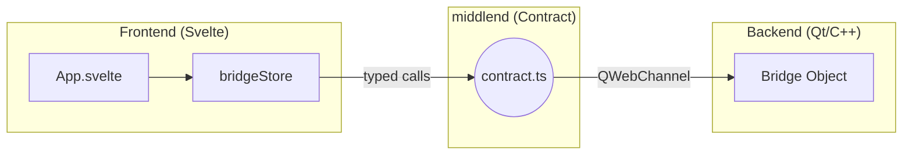

# 🌉 middlend Layer — Bridge Documentation

This folder contains the **Contract** that defines how the C++ Backend and the Svelte Frontend communicate. This approach is inspired by `tRPC`, ensuring that both sides speak the same "language" with strong typing.

## 📜 The Contract

The definition lives in [contract.ts](./contract.ts).

### 📤 Methods (Frontend ➔ Backend)
These are actions triggered by the UI that execute in C++.

| Method | Description | Return |
| :--- | :--- | :--- |
| `openFileDialog()` | Opens a native file picker. | `Promise<string>` (File Path) |
| `loadPdf(path)` | Commands the backend to read a PDF file. | `void` |
| `translate(text, lang)` | Sends text to the C++ translation engine. | `void` |

### 📥 Signals (Backend ➔ Frontend)
These are events emitted by C++ that the UI listens to.

| Signal | Payload | Description |
| :--- | :--- | :--- |
| `pdfLoaded` | `(data, pages)` | Triggered after `loadPdf` finishes processing. |
| `translationReady` | `(orig, trans)` | Triggered when a translation result is available. |
| `errorOccurred` | `(message)` | Triggered on backend-side errors. |

---

## 🛠 How to implement new features

1.  **Update the Contract**: Add the new method or signal to `middlend/contract.ts`.
2.  **C++ Side**: 
    *   Open `backend/bridge.h` and add the corresponding `Q_INVOKABLE` method or `Q_SIGNAL`.
    *   Implement logic in `backend/bridge.cpp`.
3.  **Svelte Side**:
    *   The Typescript compiler will immediately show errors if the UI doesn't match the new contract.
    *   Use the `bridgeStore` to call the new method.

## 🔗 Architecture

